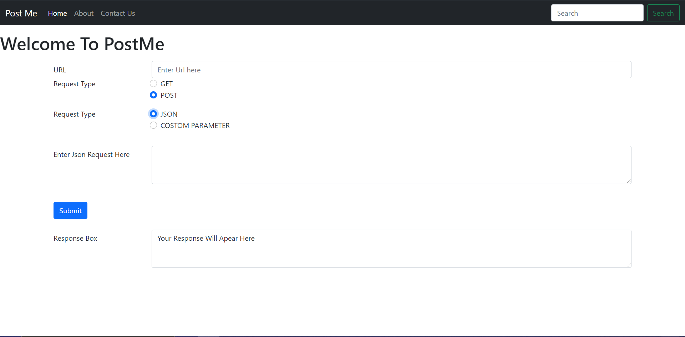
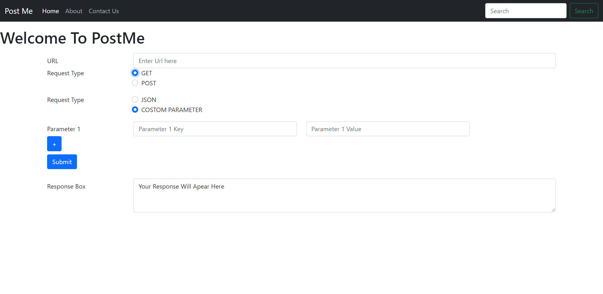

## **POST-MaN-Clone**
This is a demo project based on Javascript.

## **Contents**

1. [Description](#Description)
0. [Installation](#Installation)
0. [Languages](#Languages)
0. [Contribution](#Contribution)

## **Description**
Postman is the world's leading API platform. Postman's features simplify each step of building an API and streamline collaboration to help create better.
 
 So, i think to make a POST MAN Clone.

### How this Project will Help Us?
This project will help **Vanilla Javascript** developers to start making APIs and implementing in this clone as well as provide an insight to the working of a basic **POST MAN** system.

## **Installation**
### Softeares Required :

- [visual Studio Code](https://code.visualstudio.com/download)

- [Live Server](https://marketplace.visualstudio.com/items?itemName=ritwickdey.LiveServer)

___Just install Live Server from VS Code extensions, open the repository on VS code and start working on the index.html .___

## **Languages**

- 
 

## **Projects Picture :**
 
 
 

## **Contribution**
This is a concept for beginners starting with JavaScript API . Feel free to fork, clone, create issues and/or make PRs. We will be more than happy to receive your contributions.

